# Cost Detective — AWS FinOps Audit Walkthrough

End-to-end reproduction guide covering all three parts of the audit: zombie asset detection and cleanup, governance (budgets + tagging policy), and cost-aware Auto Scaling with Spot Instances.

**Account:** `309797288544` | **Region:** `eu-central-1` | **CLI Profile:** `cost-detective`

---

## Table of Contents

1. [Setup — IAM User & CLI Profile](#0-setup--iam-user--cli-profile)
2. [Part 1 — Zombie Asset Detection & Cleanup](#part-1--zombie-asset-detection--cleanup)
3. [Part 2 — Governance](#part-2--governance)
4. [Part 3 — Cost-Aware Auto Scaling Group](#part-3--cost-aware-auto-scaling-group)

---

## 0. Setup — IAM User & CLI Profile

### What this does

Creates a least-privilege IAM user (`CostDetective`) and configures a named AWS CLI profile so every script in the project authenticates as that user rather than with root credentials.

### Files

- `scripts/iam/cost_detective_policy.json` — consolidated IAM policy (v5) covering all audit actions
- `scripts/iam/setup_iam_user.sh` — creates the user, attaches the policy, generates keys, writes the CLI profile

### IAM Policy (`scripts/iam/cost_detective_policy.json`)

The final consolidated policy (v5). All permissions are in one managed policy — no inline patches needed in a fresh setup.

```json
{
  "Version": "2012-10-17",
  "Statement": [
    {
      "Sid": "EC2",
      "Effect": "Allow",
      "Action": [
        "ec2:Describe*",
        "ec2:CreateVolume", "ec2:DeleteVolume", "ec2:AllocateAddress", "ec2:ReleaseAddress",
        "ec2:RunInstances", "ec2:TerminateInstances", "ec2:StopInstances", "ec2:DetachVolume",
        "ec2:CreateSecurityGroup", "ec2:DeleteSecurityGroup",
        "ec2:AuthorizeSecurityGroupIngress", "ec2:RevokeSecurityGroupIngress",
        "ec2:CreateLaunchTemplate", "ec2:DeleteLaunchTemplate", "ec2:CreateTags",
        "ec2:CreateVpc", "ec2:DeleteVpc", "ec2:ModifyVpcAttribute",
        "ec2:CreateSubnet", "ec2:DeleteSubnet", "ec2:ModifySubnetAttribute",
        "ec2:CreateInternetGateway", "ec2:DeleteInternetGateway",
        "ec2:AttachInternetGateway", "ec2:DetachInternetGateway",
        "ec2:CreateRouteTable", "ec2:DeleteRouteTable",
        "ec2:CreateRoute", "ec2:DeleteRoute",
        "ec2:AssociateRouteTable", "ec2:DisassociateRouteTable"
      ],
      "Resource": "*"
    },
    {
      "Sid": "BudgetsAndAlerts",
      "Effect": "Allow",
      "Action": [
        "budgets:CreateBudget", "budgets:ModifyBudget", "budgets:DescribeBudgets", "budgets:ViewBudget",
        "sns:CreateTopic", "sns:Subscribe", "sns:ListTopics", "sns:GetTopicAttributes", "sns:SetTopicAttributes"
      ],
      "Resource": "*"
    },
    {
      "Sid": "CostExplorerAndTrustedAdvisor",
      "Effect": "Allow",
      "Action": [
        "ce:*", "aws-portal:ViewBilling",
        "trustedadvisor:Describe*",
        "support:DescribeTrustedAdvisorChecks", "support:DescribeTrustedAdvisorCheckResult"
      ],
      "Resource": "*"
    },
    {
      "Sid": "Config",
      "Effect": "Allow",
      "Action": [
        "config:PutConfigRule", "config:Describe*", "config:List*", "config:Get*",
        "config:PutConfigurationRecorder", "config:StartConfigurationRecorder",
        "config:PutDeliveryChannel", "config:BatchGetResourceConfig"
      ],
      "Resource": "*"
    },
    {
      "Sid": "CloudFormation",
      "Effect": "Allow",
      "Action": ["cloudformation:*"],
      "Resource": "*"
    },
    {
      "Sid": "AutoScaling",
      "Effect": "Allow",
      "Action": ["autoscaling:*"],
      "Resource": "*"
    },
    {
      "Sid": "IAM",
      "Effect": "Allow",
      "Action": [
        "iam:CreateRole", "iam:DeleteRole", "iam:AttachRolePolicy", "iam:DetachRolePolicy",
        "iam:TagRole", "iam:UntagRole",
        "iam:CreateInstanceProfile", "iam:DeleteInstanceProfile",
        "iam:AddRoleToInstanceProfile", "iam:RemoveRoleFromInstanceProfile",
        "iam:GetRole", "iam:GetInstanceProfile", "iam:PassRole",
        "iam:ListRoles", "iam:CreateServiceLinkedRole"
      ],
      "Resource": "*"
    },
    {
      "Sid": "S3ForConfig",
      "Effect": "Allow",
      "Action": ["s3:CreateBucket", "s3:PutBucketPolicy", "s3:GetBucketAcl", "s3:PutObject", "s3:ListBucket"],
      "Resource": "*"
    },
    {
      "Sid": "SSM",
      "Effect": "Allow",
      "Action": ["ssm:GetParameter", "ssm:GetParameters"],
      "Resource": "*"
    }
  ]
}
```

### Steps to Reproduce

```bash
# Run with admin/root credentials
bash scripts/iam/setup_iam_user.sh

# Verify the profile works
aws sts get-caller-identity --profile cost-detective
```

Expected output:
```json
{
    "UserId": "AIDAXXXXXXXXXXXXXXXXX",
    "Account": "309797288544",
    "Arn": "arn:aws:iam::309797288544:user/CostDetective"
}
```

> **Screenshot placeholder — IAM user setup**
> *AWS Console → IAM → Users → CostDetective showing the user and attached CostDetectivePolicy*

---

## Part 1 — Zombie Asset Detection & Cleanup

### What are Zombie Assets?

| Asset | Zombie Condition | Typical Monthly Cost |
|---|---|---|
| EBS Volume | `status = available` (not attached to any instance) | ~$0.08–$0.10/GB |
| Elastic IP | Allocated but not associated with a running instance | ~$3.65/IP |
| EC2 Instance | Running at 0–5% CPU for 14+ days (oversized/idle) | Varies by type |

---

### Step 1a — Simulate Zombie Resources

The script creates three types of waste resources to audit against:

1. **Unassociated Elastic IP** — allocated but never attached to an instance
2. **Oversized idle EC2 instance** — `m5.xlarge` with no workload
3. **Detached EBS volume** — root volume detached from a stopped `t2.micro`

> **Note:** DCE sandbox accounts block `ec2:CreateVolume` directly via SCP, so EBS waste is
> simulated by launching a `t2.micro`, stopping it, and detaching its root volume — leaving it
> in `available` (unattached) state.

**File:** `scripts/simulate_waste.sh`

```bash
bash scripts/simulate_waste.sh
```

Sample output:
```
=============================================
 Cost Detective — Waste Simulation
 Region : eu-central-1
 Profile: cost-detective
=============================================

[1/4] Allocating unassociated Elastic IP...
    ✓ Allocated EIP: 18.184.x.x (AllocationId: eipalloc-0abc123def)

[2/4] Launching oversized idle EC2 instance (m5.xlarge)...
    ✓ Launched instance: i-0d3910c054498f3ef (m5.xlarge — idle, no workload)

[3/4] Launching t2.micro to generate a detachable EBS root volume...
    ✓ Launched donor instance: i-06aeee54909de9a94
    Waiting for instance to reach 'running' state...
    ✓ Instance is running
    Stopping instance...
    ✓ Instance stopped
    Detaching root volume vol-0xxxxxxxxxxxxxxxxx...
    ✓ Volume detached: vol-0xxxxxxxxxxxxxxxxx (status: available — zombie EBS)

[4/4] All waste resources created.

=============================================
 Zombie resources ready for the audit:
   Elastic IP    : 18.184.x.x (eipalloc-0abc123def)
   Idle Instance : i-0d3910c054498f3ef (m5.xlarge)
   Zombie Volume : vol-0xxxxxxxxxxxxxxxxx (detached, available)
   Donor Instance: i-06aeee54909de9a94 (stopped — can terminate)
=============================================
```

> **Simulation terminal output**
> 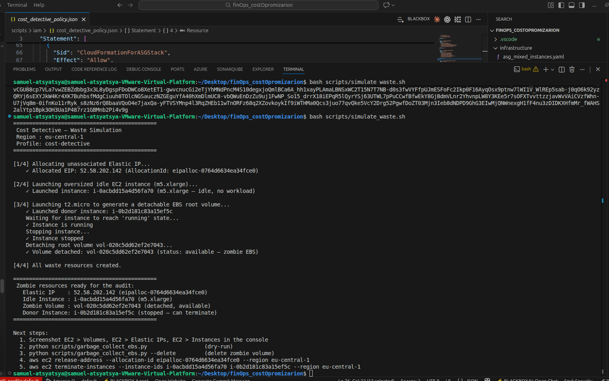
> *Terminal: simulate_waste.sh creating the EIP, idle m5.xlarge, and detached EBS volume*

> **Zombie resources in the console**
> 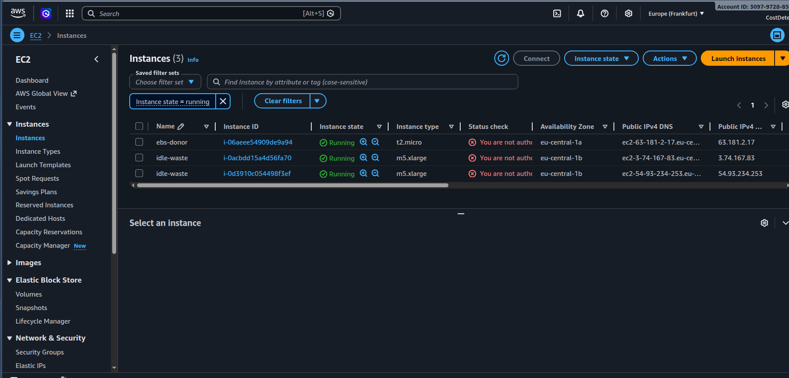
> *AWS Console → EC2 → Instances showing the idle m5.xlarge and stopped t2.micro*

> 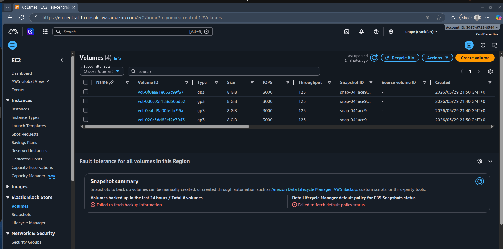
> *AWS Console → EC2 → Volumes showing the detached volume in "available" state*

> 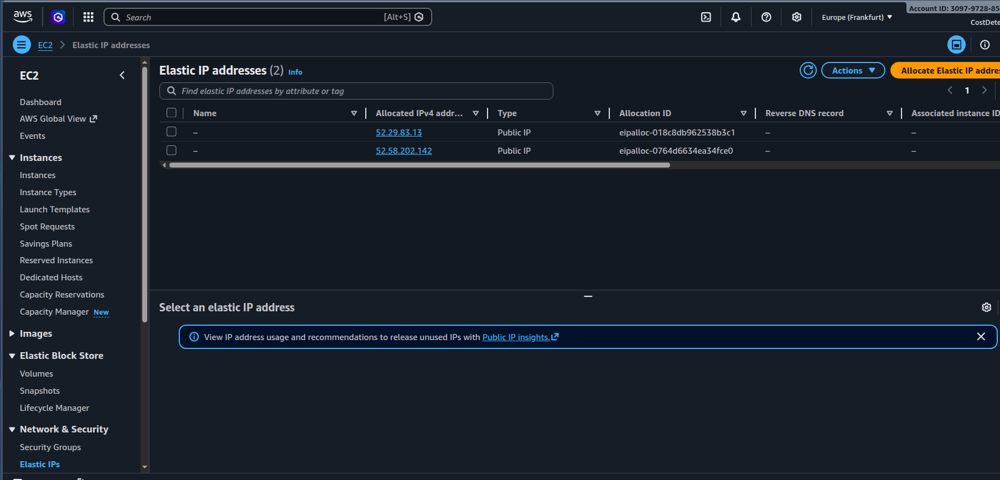
> *AWS Console → EC2 → Elastic IPs showing the unassociated IPs*

---

### Step 1b — Detect with AWS Trusted Advisor

Navigate to: **AWS Console → Trusted Advisor → Cost Optimization**

Key checks:
- *Low Utilization Amazon EC2 Instances* — flags instances with <10% CPU over 14 days
- *Unassociated Elastic IP Addresses* — lists all unattached EIPs
- *Underutilized Amazon EBS Volumes* — flags volumes with <1 IOPS/day

> **Note:** Full Trusted Advisor checks require Business or Enterprise Support. Free tier shows a subset.

> 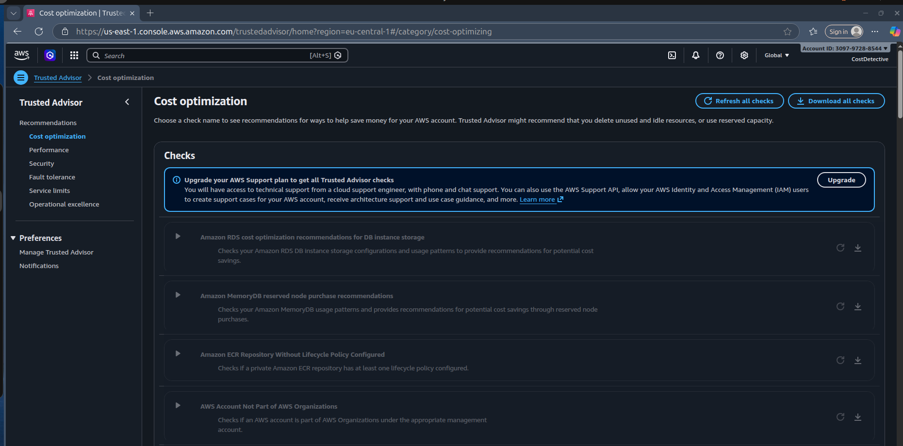
> *Trusted Advisor → Cost Optimization checks*

---

### Step 1c — Detect with AWS Cost Explorer

1. Go to **Cost Explorer → Rightsizing Recommendations**
2. Filter by service: EC2
3. Look for instances flagged as "Terminate" or "Downsize"

> 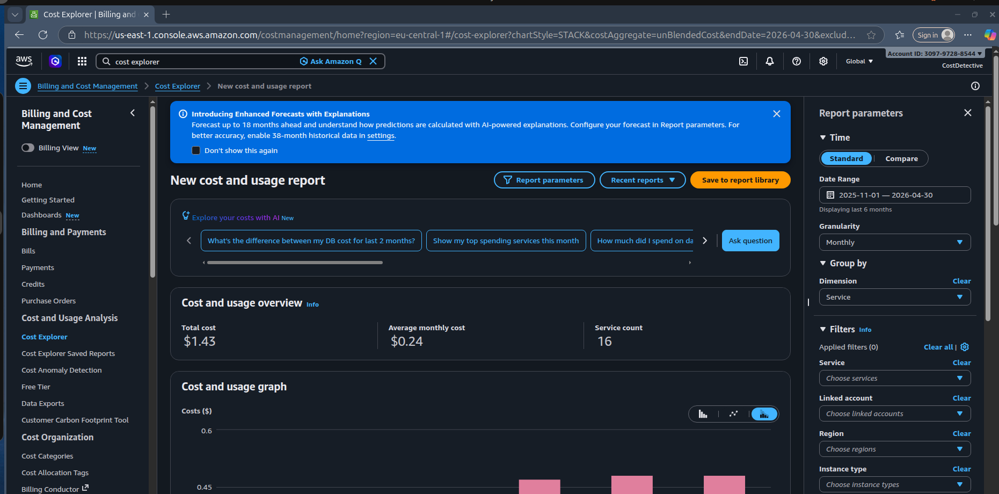
> *Cost Explorer → Cost and usage overview*

> 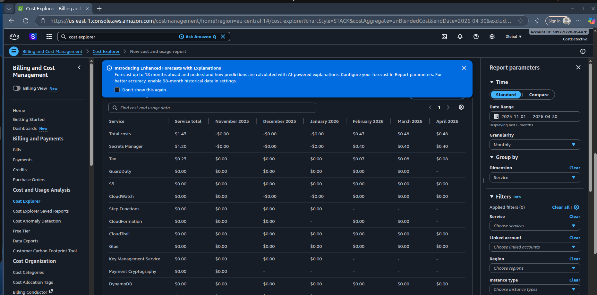
> *Cost Explorer → Service cost breakdown*

---

### Step 1d — Run the EBS Garbage Collector

**File:** `scripts/garbage_collect_ebs.py`

Scans all EBS volumes with `status = available` using a paginator, prints a summary table, and optionally deletes them.

```bash
# Dry-run — list all unattached volumes, delete nothing
python3 scripts/garbage_collect_ebs.py

# Delete after confirming the list
python3 scripts/garbage_collect_ebs.py --delete
```

Sample dry-run output:
```
Found 1 unattached volume(s) — 8 GB total

VolumeId                  Size   Type       Age          Name
---------------------------------------------------------------------------
vol-0xxxxxxxxxxxxxxxxx    8GB    gp3        0d 1h        -

[DRY-RUN] No volumes deleted. Re-run with --delete to remove them.
```

Sample delete output:
```
Deleting volumes...
  ✓ Deleted vol-0xxxxxxxxxxxxxxxxx

Done. Deleted: 1 | Failed: 0 | Freed: ~8 GB
```

> 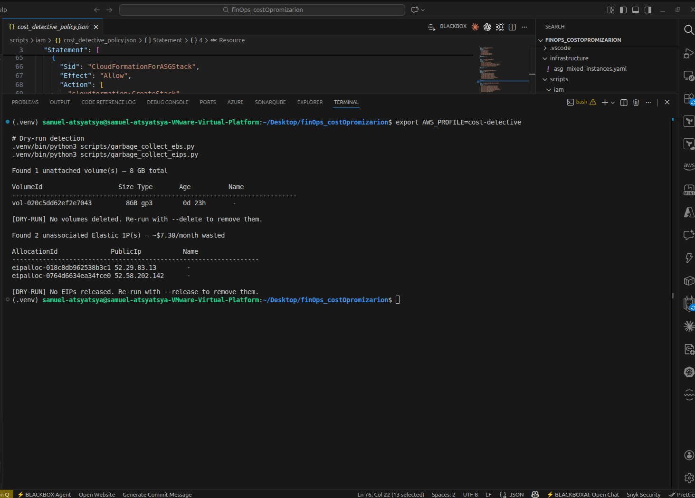
> *Terminal: dry-run listing the zombie volume (no deletion)*

---

### Step 1e — Run the EIP Garbage Collector

**File:** `scripts/garbage_collect_eips.py`

Finds all VPC Elastic IPs with no `AssociationId` (not attached to any instance or ENI).

```bash
# Dry-run first
python3 scripts/garbage_collect_eips.py

# Release after confirming
python3 scripts/garbage_collect_eips.py --release
```

Sample dry-run output:
```
Found 1 unassociated Elastic IP(s) — ~$3.65/month wasted

AllocationId              PublicIp           Name
-----------------------------------------------------------------
eipalloc-0abc123def456    18.184.x.x         -

[DRY-RUN] No EIPs released. Re-run with --release to remove them.
```

Sample release output:
```
Releasing EIPs...
  ✓ Released eipalloc-0abc123def456 (18.184.x.x)

Done. Released: 1 | Failed: 0 | Saved: ~$3.65/month
```

> 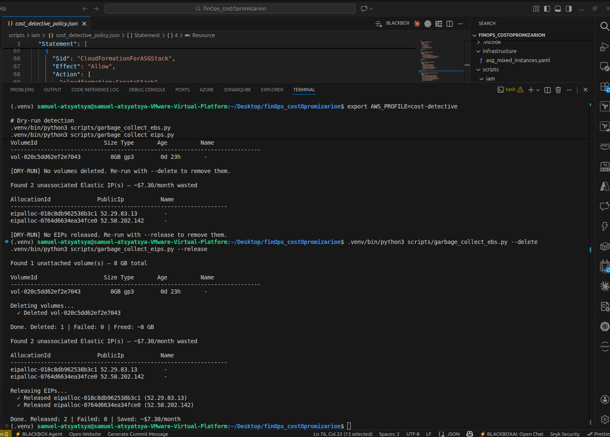
> *Terminal: garbage_collect_ebs.py --delete and garbage_collect_eips.py --release*

---

### Step 1f — Full Cleanup (Post-Demo Teardown)

After screenshots are captured, tear everything down with one script.

**File:** `scripts/cleanup_waste.sh`

```bash
export ALLOC_ID=eipalloc-0abc123def456
export IDLE_INSTANCE_ID=i-0d3910c054498f3ef
export EBS_INSTANCE_ID=i-06aeee54909de9a94
export VOLUME_ID=vol-0xxxxxxxxxxxxxxxxx

bash scripts/cleanup_waste.sh
```

Sample output:
```
=============================================
 Cost Detective — Waste Cleanup
 Region : eu-central-1
 Profile: cost-detective
=============================================

[1/4] Releasing Elastic IP (eipalloc-0abc123def456)...
    ✓ Elastic IP released

[2/4] Deleting zombie EBS volume (vol-0xxxxxxxxxxxxxxxxx)...
    ✓ EBS volume deleted

[3/4] Terminating EC2 instances (i-0d3910c054498f3ef, i-06aeee54909de9a94)...
    Waiting for both instances to reach 'terminated' state...
    ✓ Both instances terminated

[4/4] All zombie resources removed.

=============================================
 Cleanup complete — no billable waste remains
=============================================
```

> **Note:** If the EIP and volume have already been cleaned up (e.g. by the garbage collector scripts)
> and only instances remain, terminate them directly:
> ```bash
> aws ec2 terminate-instances \
>   --instance-ids <IDLE_INSTANCE_ID> <EBS_INSTANCE_ID> \
>   --profile cost-detective --region eu-central-1
> ```


---

## Part 2 — Governance

### Step 2a — AWS Budget with SNS Email Alerts

**File:** `scripts/create_budget.py`

Creates a monthly cost budget with two alert thresholds routed through an SNS topic to email:

| Alert | Type | Threshold |
|---|---|---|
| Alert 1 | Forecasted | >100% of limit (forecast will exceed $50) |
| Alert 2 | Actual | >80% of limit (actual spend has hit $40) |

```bash
python3 scripts/create_budget.py \
  --account-id 309797288544 \
  --email your-email@example.com \
  --limit 50
```

Sample output:
```
SNS topic created: arn:aws:sns:eu-central-1:309797288544:CostDetective-Budget-Alerts
  → Confirmation email sent to your-email@example.com — confirm the subscription before alerts fire.

Budget 'CostDetective-Monthly-Budget' created:
  Limit      : $50.0/month
  Alert 1    : Forecasted spend > 100% of limit (>$50.0)
  Alert 2    : Actual spend > 80% of limit (>$40)
  Notify via : arn:aws:sns:eu-central-1:309797288544:CostDetective-Budget-Alerts
```

> **Important:** Check your inbox for the SNS confirmation email and click **Confirm subscription** — alerts will not be delivered until confirmed.

> 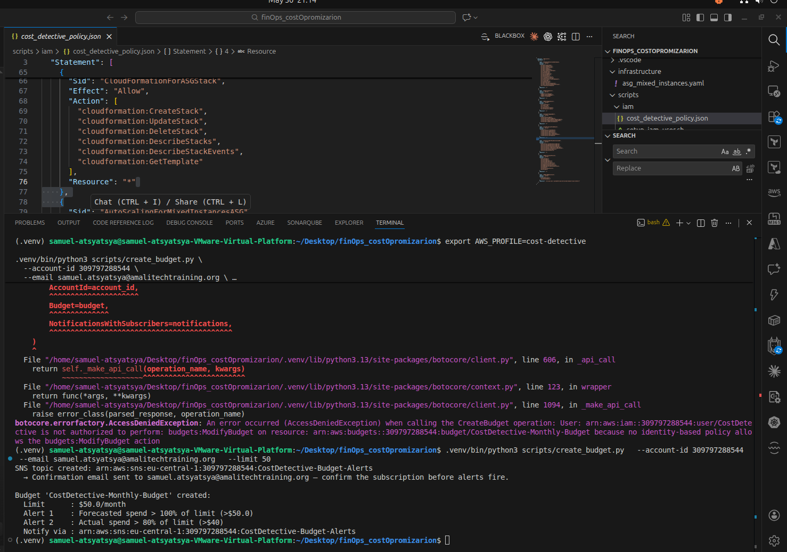
> *Terminal: create_budget.py output showing SNS topic and budget created*

> 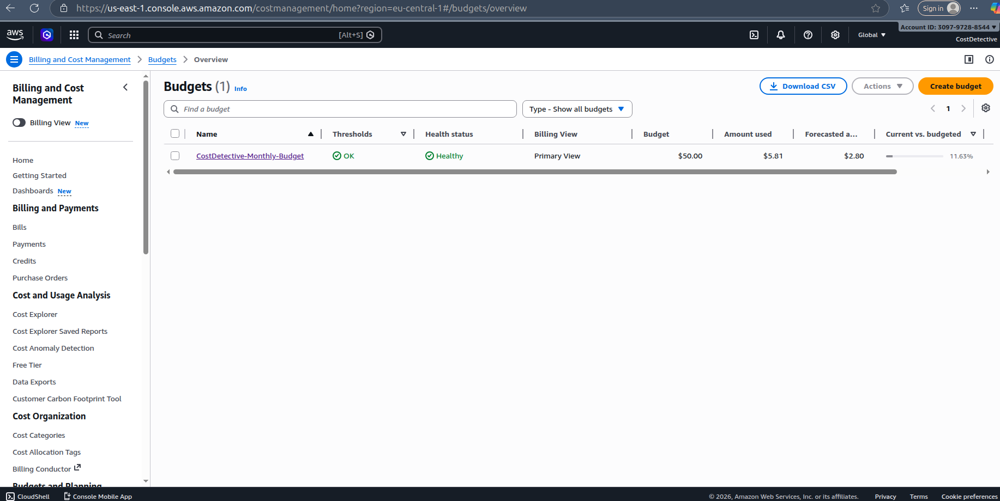
> *AWS Console → Billing → Budgets showing CostDetective-Monthly-Budget ($50, Healthy)*

---

### Step 2b — Tagging Policy

A tagging policy ensures every resource is attributable to a team or project — the foundation of cost allocation.

**Mandatory tag required:** `CostCenter`

#### Option A — Service Control Policy (Preventive)

**File:** `scripts/tagging_policy/scp_require_costcenter.json`

Blocks `ec2:RunInstances` and `ec2:CreateVolume` if the `CostCenter` tag is missing. Applied at the AWS Organizations OU level — stops non-compliant resources from being created in the first place.

```json
{
  "Version": "2012-10-17",
  "Statement": [
    {
      "Sid": "RequireCostCenterTagOnEC2",
      "Effect": "Deny",
      "Action": ["ec2:RunInstances"],
      "Resource": "arn:aws:ec2:*:*:instance/*",
      "Condition": {
        "Null": { "aws:RequestTag/CostCenter": "true" }
      }
    },
    {
      "Sid": "RequireCostCenterTagOnEBSVolume",
      "Effect": "Deny",
      "Action": ["ec2:RunInstances", "ec2:CreateVolume"],
      "Resource": "arn:aws:ec2:*:*:volume/*",
      "Condition": {
        "Null": { "aws:RequestTag/CostCenter": "true" }
      }
    }
  ]
}
```

```bash
# Create the SCP (run as management account)
aws organizations create-policy \
  --name "RequireCostCenterTag" \
  --type SERVICE_CONTROL_POLICY \
  --description "Blocks EC2 launches without CostCenter tag" \
  --content file://scripts/tagging_policy/scp_require_costcenter.json

# Attach to your OU
aws organizations attach-policy \
  --policy-id p-xxxxxxxxxx \
  --target-id ou-xxxx-xxxxxxxx
```

> **Note:** SCPs require AWS Organizations. The management account is exempt — test in a member account.

#### Option B — AWS Config Rule (Detective)

**File:** `scripts/tagging_policy/deploy_config_rule.py`

Flags existing non-compliant resources without blocking them. Good for brownfield environments. The script handles the full AWS Config setup:

1. Creates the S3 bucket for Config snapshots (`cost-detective-config-<account-id>`)
2. Creates the `CostDetectiveConfigRole` IAM role for the Config service
3. Creates a configuration recorder scoped to `EC2::Instance` and `EC2::Volume`
4. Creates the delivery channel pointing to the S3 bucket
5. Starts the recorder
6. Deploys the `REQUIRED_TAGS` managed rule

```bash
python3 scripts/tagging_policy/deploy_config_rule.py --profile cost-detective
```

Sample output:
```
[1/5] Setting up S3 delivery bucket...
  ✓ S3 bucket created: cost-detective-config-309797288544
  ✓ Bucket policy applied

[2/5] Setting up Config IAM role...
  ✓ IAM role created: CostDetectiveConfigRole
  ⏳ Waiting 15s for IAM propagation...

[3/5] Setting up configuration recorder...
  ✓ Configuration recorder created

[4/5] Setting up delivery channel...
  ✓ Delivery channel created

[5/5] Starting recorder and deploying rule...
  ✓ Recorder started
  ✓ Config rule 'require-costcenter-tag-on-ec2' deployed

Done. Check AWS Config -> Rules in ~10 minutes for compliance results.
```

Verify via CLI immediately after:
```bash
aws configservice describe-config-rules \
  --profile cost-detective --region eu-central-1

aws configservice describe-configuration-recorder-status \
  --profile cost-detective --region eu-central-1
```

> 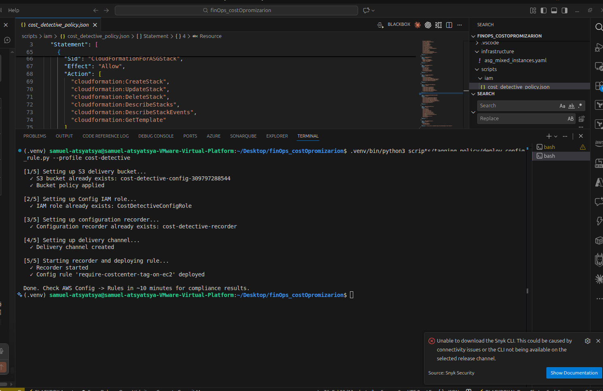
> *Terminal: deploy_config_rule.py setting up S3, IAM role, recorder, delivery channel and rule*

> 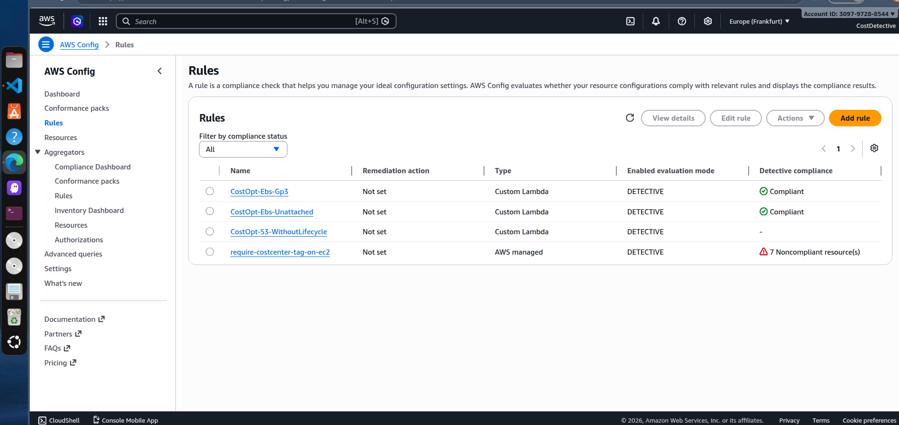
> *AWS Console → Config → Rules showing require-costcenter-tag-on-ec2 with compliance status*

---

## Part 3 — Cost-Aware Auto Scaling Group

### Concept: Mixed Instances Policy

Instead of paying full On-Demand price for every instance, the ASG uses a Mixed Instances Policy:

| Capacity tier | Purchase model |
|---|---|
| Base (always on) | On-Demand — guaranteed, never interrupted |
| Scale-out (above base) | 25% On-Demand + **75% Spot** |

Spot Instances are typically **60–90% cheaper** than On-Demand. With `price-capacity-optimized` strategy, AWS selects the Spot pool least likely to be interrupted.

Five instance types are configured as overrides across two families (`t3`, `t3a`, `t2`) — if one Spot pool is unavailable or prices spike, the ASG falls back to another.

### Infrastructure Files

| File | Purpose |
|---|---|
| `infrastructure/vpc.yaml` | VPC, 2 public subnets (eu-central-1a/b), IGW, route table |
| `infrastructure/asg_mixed_instances.yaml` | Launch Template, IAM role, Security Group, ASG, Scaling Policy |
| `scripts/deploy_stacks.sh` | Idempotent deploy — VPC stack first, then ASG stack |
| `scripts/teardown_stacks.sh` | Safe teardown — ASG first (removes Fn::ImportValue dependency), then VPC; auto-retries on DELETE_FAILED |

The two stacks are linked via **CloudFormation Exports**: `vpc.yaml` exports `VpcId` and `SubnetIds`, and `asg_mixed_instances.yaml` reads them with `Fn::ImportValue` — no manual copy-pasting of IDs.

### Deploy

```bash
bash scripts/deploy_stacks.sh
```

Sample output:
```
[1/2] Deploying VPC stack (cost-detective-vpc)...
Successfully created/updated stack - cost-detective-vpc

  VPC stack outputs:
+---------------+--------------------------------------------------+
|  VpcId        |  vpc-077600669d1c8beef                           |
|  PublicSubnetA|  subnet-09c220c7eedaa0f28                        |
|  PublicSubnetB|  subnet-0e6db90d629cda4d5                        |
|  SubnetIds    |  subnet-09c220c7eedaa0f28,subnet-0e6db90d629cda4d5|
+---------------+--------------------------------------------------+

[2/2] Deploying ASG stack (cost-detective-asg)...
Successfully created/updated stack - cost-detective-asg

  ASG stack outputs:
+-------------------+------------------------------------------------------------+
|  ASGName          |  cost-detective-asg                                        |
|  LaunchTemplateId |  lt-061046c33930494c9                                      |
|  CostBreakdownNote|  Base: 1 On-Demand. Scale-out: 25% On-Demand + 75% Spot.  |
+-------------------+------------------------------------------------------------+
```

> 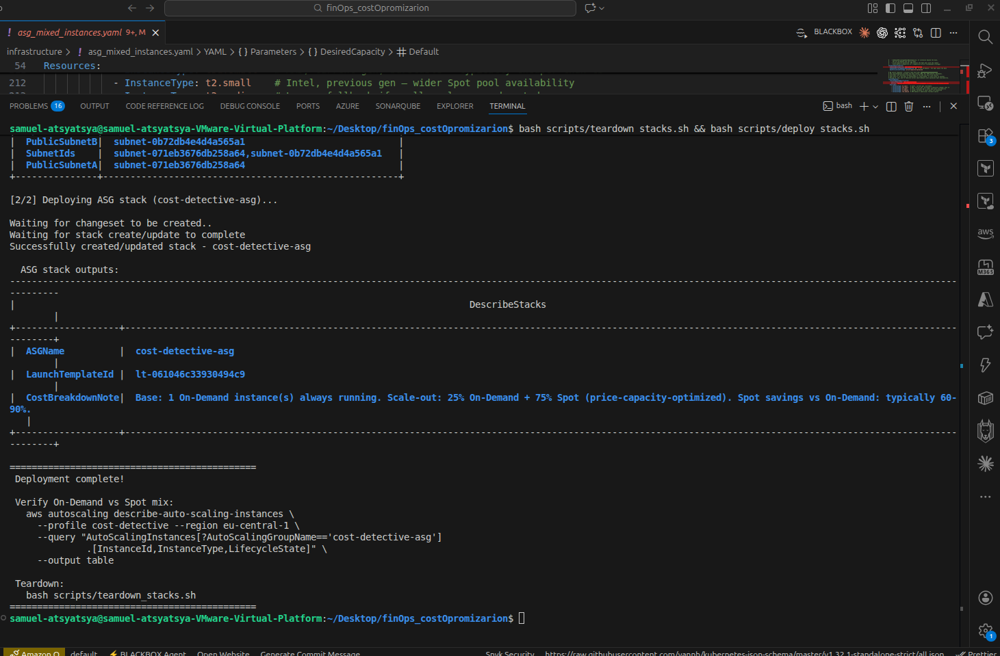
> *Terminal: deploy_stacks.sh — both VPC and ASG stacks deployed with outputs*

### Verify the On-Demand / Spot Mix

With `DesiredCapacity=2` (default), AWS may launch both as On-Demand. Scale to 4 to force Spot instances — this gives 3 instances above the base, of which 2 (~75%) will be Spot:

```bash
aws autoscaling update-auto-scaling-group \
  --auto-scaling-group-name cost-detective-asg \
  --desired-capacity 4 \
  --profile cost-detective --region eu-central-1

# Wait ~30s then check lifecycle
aws ec2 describe-instances \
  --profile cost-detective --region eu-central-1 \
  --filters "Name=tag:aws:autoscaling:groupName,Values=cost-detective-asg" \
            "Name=instance-state-name,Values=running,pending" \
  --query "Reservations[*].Instances[*].[InstanceId,InstanceType,InstanceLifecycle,State.Name]" \
  --output table
```

Actual output observed during this audit:
```
--------------------------------------------------------
|                   DescribeInstances                  |
+----------------------+-----------+-------+-----------+
|  i-053b66473739bb4be |  t3.small |  None |  running  |   ← On-Demand (25% above base)
|  i-0159d8e29317727c6 |  t3.small |  None |  running  |   ← On-Demand (base)
|  i-03b6ec75e46ad009c |  t2.small |  spot |  running  |   ← Spot
|  i-09e5fee7f1c40b715 |  t2.small |  spot |  running  |   ← Spot
+----------------------+-----------+-------+-----------+
```

`InstanceLifecycle = None` means On-Demand. `spot` means Spot. The ASG also selected `t2.small` for the Spot instances — demonstrating multi-family instance type diversification.

Verify the MixedInstancesPolicy distribution is correctly set:
```bash
aws autoscaling describe-auto-scaling-groups \
  --auto-scaling-group-names cost-detective-asg \
  --profile cost-detective --region eu-central-1 \
  --query "AutoScalingGroups[0].MixedInstancesPolicy.InstancesDistribution" \
  --output table
```

Expected output:
```
+--------------------------------------+----------------------------+
|  OnDemandAllocationStrategy          |  prioritized               |
|  OnDemandBaseCapacity                |  1                         |
|  OnDemandPercentageAboveBaseCapacity |  25                        |
|  SpotAllocationStrategy              |  price-capacity-optimized  |
+--------------------------------------+----------------------------+
```

> 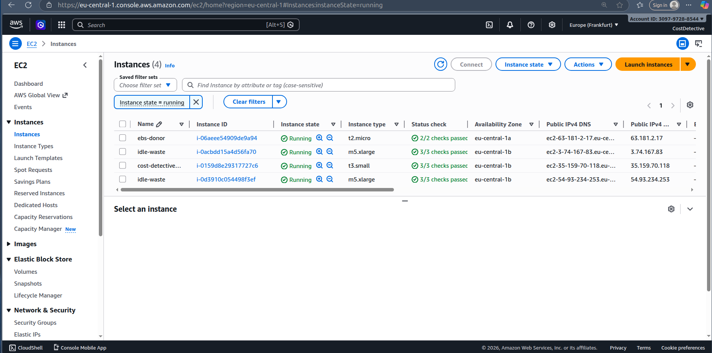
> *AWS Console → EC2 → Instances showing all 4 ASG instances running*

> 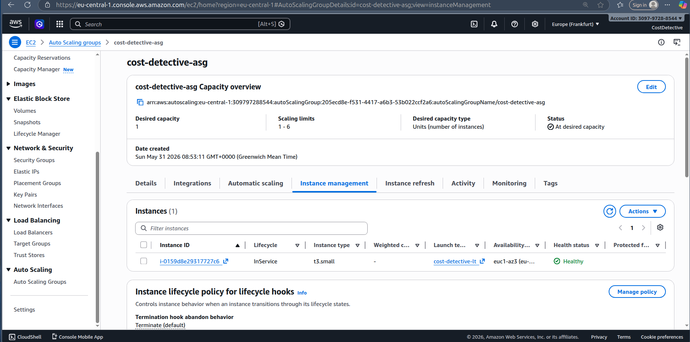
> *AWS Console → EC2 → Auto Scaling Groups → cost-detective-asg → Instance management tab*

> 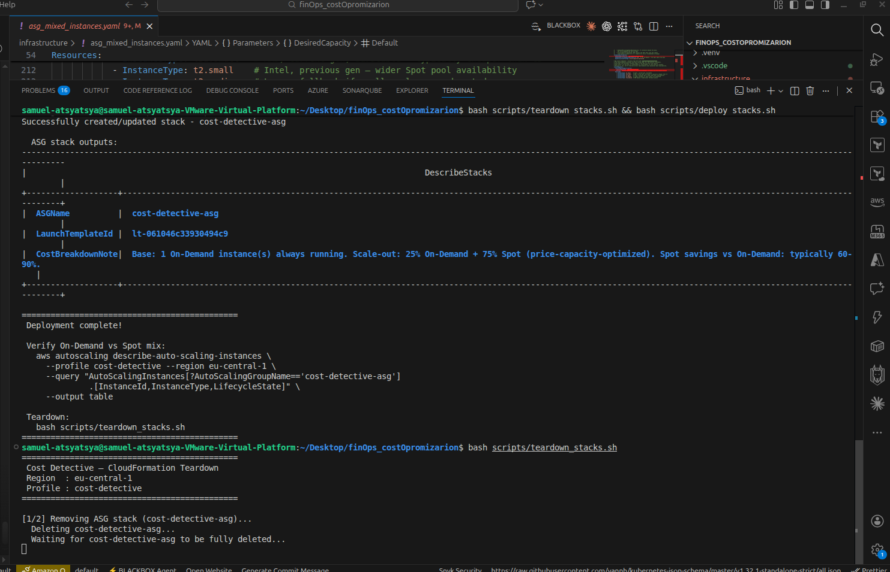
> *Terminal: describe-instances output showing 2 Spot (t2.small) and 2 On-Demand (t3.small)*

### Teardown

```bash
bash scripts/teardown_stacks.sh
```

The script deletes the ASG stack first (removes the `Fn::ImportValue` dependency), then the VPC stack. If any resource fails to delete due to a permission error, it automatically retries with `--retain-resources` and cleans up the orphan manually.

> 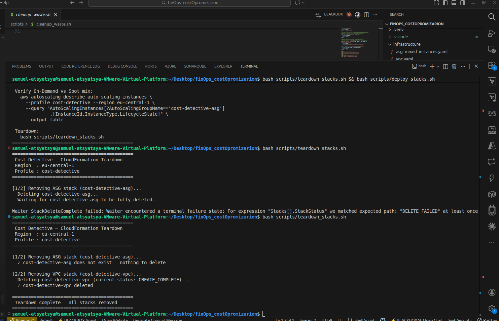
> *Terminal: teardown_stacks.sh deleting both stacks cleanly*

---

## Estimated Savings Summary

| Action | Monthly Saving |
|---|---|
| Delete 1 × 8 GB unattached EBS volume | ~$0.80 |
| Release 1 unassociated Elastic IP | ~$3.65 |
| Downsize 1 idle m5.xlarge → t3.small | ~$100+ |
| 75% Spot on scale-out capacity (4 instances, t3.small) | ~$30–50 |
| **Total (this demo scenario)** | **~$135–155/month** |

Actual savings depend on region, instance hours, and workload profile.

---

## Key Commands Reference

```bash
# ── Setup ──────────────────────────────────────────────────────────────────
# Create IAM user and CLI profile (run with admin credentials)
bash scripts/iam/setup_iam_user.sh

# Verify the profile works
aws sts get-caller-identity --profile cost-detective

# ── Part 1 — Zombie Asset Detection & Cleanup ──────────────────────────────
# Create zombie resources
bash scripts/simulate_waste.sh

# Scan for zombie EBS volumes (dry-run)
python3 scripts/garbage_collect_ebs.py

# Delete zombie EBS volumes
python3 scripts/garbage_collect_ebs.py --delete

# Scan for unassociated Elastic IPs (dry-run)
python3 scripts/garbage_collect_eips.py

# Release unassociated Elastic IPs
python3 scripts/garbage_collect_eips.py --release

# Tear down all simulation resources
export ALLOC_ID=eipalloc-xxx IDLE_INSTANCE_ID=i-xxx EBS_INSTANCE_ID=i-xxx VOLUME_ID=vol-xxx
bash scripts/cleanup_waste.sh

# ── Part 2 — Governance ────────────────────────────────────────────────────
# Create budget + SNS alert
python3 scripts/create_budget.py \
  --account-id 309797288544 \
  --email you@example.com \
  --limit 50

# Deploy AWS Config tagging rule (full setup — idempotent)
python3 scripts/tagging_policy/deploy_config_rule.py --profile cost-detective

# Verify Config rule and recorder status
aws configservice describe-config-rules --profile cost-detective --region eu-central-1
aws configservice describe-configuration-recorder-status --profile cost-detective --region eu-central-1

# ── Part 3 — Cost-Aware ASG ────────────────────────────────────────────────
# Deploy VPC + ASG stacks (idempotent)
bash scripts/deploy_stacks.sh

# Scale to 4 to trigger Spot instance launches
aws autoscaling update-auto-scaling-group \
  --auto-scaling-group-name cost-detective-asg \
  --desired-capacity 4 \
  --profile cost-detective --region eu-central-1

# Verify Spot vs On-Demand mix
aws ec2 describe-instances \
  --profile cost-detective --region eu-central-1 \
  --filters "Name=tag:aws:autoscaling:groupName,Values=cost-detective-asg" \
            "Name=instance-state-name,Values=running,pending" \
  --query "Reservations[*].Instances[*].[InstanceId,InstanceType,InstanceLifecycle,State.Name]" \
  --output table

# Tear down both stacks (safe, handles DELETE_FAILED automatically)
bash scripts/teardown_stacks.sh
```
